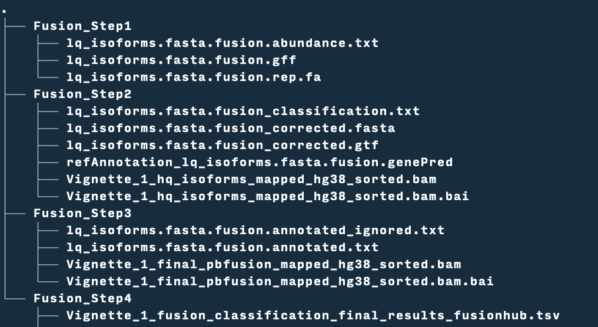
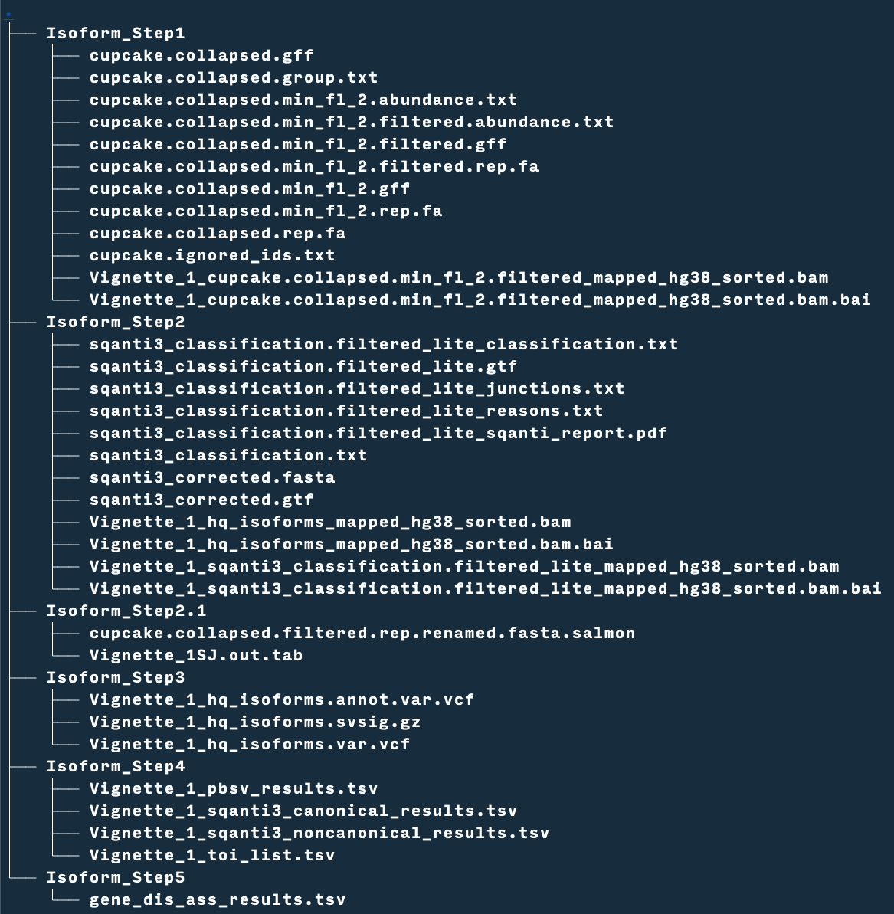

<h1 align="center">
  <br>
  <a href="https://github.com/nch-igm/PBFLIP"></a>
  <br>
  PB_FLIP
  <br>
</h1>

<h2 align="center"> PacBio Fusion and Long Isoform Pipeline <a href="https://github.com/nch-igm/PBFLIP" target="_blank">(PB_FLIP)</a>.</h4>


<p align="center">
    <a href="https://img.shields.io/badge/">
        
    </a>
    <a href="https://img.shields.io/badge/">
        
    </a>
    <a href="https://github.com/nch-igm/PBFLIP/Issues">
        
    </a>
    <a href="https://github.com/nch-igm/PBFLIP/Release">
        
    </a>
    </a>
    <a href="https://github.com/nch-igm/PBFLIP/blob/master/LICENSE">
    
  </a>
</p>

## [Overview](#1.1)

PacBio Fusion and Long Isoform Pipeline (PB_FLIP) incorporates a suite of RNA-Seq software analysis tools and scripts to identify expressed gene fusion partners and isoforms.

## [Software Dependancies](#1.2)

- Python 3.7
- Snakemake 6.9.1
- [cDNA_Cupcake ](https://github.com/Magdoll/cDNA_Cupcake) 28.0.0 
- [SQANTI3](https://github.com/ConesaLab/SQANTI3) 4.2
- [Salmon](https://salmon.readthedocs.io/en/latest/) 0.14.1
- [STAR](https://github.com/alexdobin/STAR) 2.6.1
- [minimap2](https://github.com/lh3/minimap2) 2.22
- [picard](https://github.com/broadinstitute/picard/releases/download/2.26.1/picard.jar) 2.26.1
- [pbsv](https://github.com/PacificBiosciences/pbsv) 2.6.2
- [pbmm2](https://github.com/PacificBiosciences/pbmm2)  1.4.0 
- [pbbam](https://github.com/PacificBiosciences/pbbam) 1.6.0
- bam2fastx 1.3
- [SnpEff](http://pcingola.github.io/SnpEff/) 5.0

---

## [Required External Databases](#1.3)

- [FusionHubDB](https://fusionhub.persistent.co.in/out/global/Result_0_1000.html)
- [DisGeNETDB](https://www.disgenet.org/downloads#) 7.0
  - Download curated_gene_disease_associations.tsv from the above link. 
- [isoannotlitegff3](http://app.tappas.org/resources/downloads/gffs/)
  - Download Homo_sapiens_GRCh38_Ensembl_86.zip or Mus_musculus_GRCm38_Ensembl_86.zip
- [STAR Genome Index](https://physiology.med.cornell.edu/faculty/skrabanek/lab/angsd/lecture_notes/STARmanual.pdf)
  - Provide STAR index folder for short-reads junction support 
  - Human and Mouse References can be downloaded from [Gencode](http://ftp.ebi.ac.uk/pub/databases/gencode/). The pipeline was tested with Human Genome release version 38.
  
The absolute paths to these 4 files should be added to `config/case.yml`

```bash
DISGENET:
  /data/pbflip/DisGeNET/curated_gene_disease_associations.tsv

FUSIONHUBDB:
  /data/pbflip/FusionDatabase/Fusionhub_global_summary.txt

REFERENCES:
    genome: /data/pbflip/isoseq_db/genomes/hg38.fa
    annotation: /data/pbflip/isoseq_db/genomes/gencode.v32.annotation.gtf
    isoannotlitegff3: /data/pbflip/isoseq_db/Homo_sapiens_GRCh38_Ensembl_86.gff3

GENOMEINDEX:
  star_index: /data/pbflip/star_index
```

---

## [Required Other Files ](#1.4)

```bash
TX2G:
  "/data/pbflip/isoseq_db/gencode.v32.annotation.tr2g_gtf.tsv"

```

To create `gencode.v32.annotation.tr2g_gtf.tsv`

```bash
grep -w "exon" gencode.v32_SIRVome_isoforms_ERCCs_longSIRVs_200709a_C_170612a.gtf \
        | cut -f9 | cut -f1,2,4 -d";" \
        | sed 's/gene_id //g' | sed 's/; transcript_id / /' \
        | sed 's/; gene_name / /'| uniq > gencode.v32.annotation.tr2g_gtf.tsv

```

---

## [Dependancies and Conda Environment Setup](#1.5)

Set up conda environment for the PB_FLIP pipeline

```bash
cd ~
mkdir apps
cd apps
wget https://repo.anaconda.com/miniconda/Miniconda3-py37_4.10.3-Linux-x86_64.sh
bash Miniconda3-py37_4.10.3-Linux-x86_64.sh
```

Follow the screen instruction to complete the installation.

Then, activate the base environment. 

```bash
conda activate base
```

To install some of the python dependancies:

```bash
conda install -r environment.yml
```

At this point, you can follow the instruction in [`sandbox_installer.sh`](sandbox_installer.sh)  to install rest of the dependancies.


---

## [How to Run PBFLIP?](#1.6)

1. Clone the repository to your local machine

```bash
git clone https://github.com/nch-igm/PBFLIP
cd PBFLIP
```

2. Edit `config/case.yml`
3. To run the pipeline you can issue the following command. This will run the pipeline on 16 cpu threads.

```bash
snakemake -f -p -j 16 -c 16 --latency-wait 20
```

---
## [How to Run PB-FLIP Docker Container?](#1.7)

1. Clone the repository to your local machine

```bash
git clone https://github.com/nch-igm/PBFLIP
cd PBFLIP
```

2. Edit `config/case.yml`
3. Create a folder called `pbflip`

```bash
mkdir pbflip
```

4. Download all the required databases to `pbflip` directory as described <a id='1.1'>Required External Databases</a>

5. Copy `config` folder to `pbflip`folder

```bash
pbflip/
├── Brain_Reference_SIRV_4_C99_I95
├── config
├── DisGeNET
├── FusionDatabase
├── isoseq_db
└── star_index
```

6. To run docker container in your local machine you can issue the following command. This will run the pipeline on 18 cpu threads.

```bash
docker run -d -rm -v '$(pwd)/pbflip:/data/pbflip' \
            -e 'configfile=/data/pbflip/config/case.yml' \
            -e 'threads=18' \
            -e 'result_dir=/data/pbflip' \
            public.ecr.aws/nch-igm/pb-flip:public

```

7. The final results will be under `$(pwd)/pbflip/working_dir`
---

## Inputs

Before you run PB_FLIP, you need to have the following input files from [smrtlink analyses](https://smrtlink.crii.org:8243/sl/docs/SL_Home.htm#SL_CS_SampleSetUp_Top.htm).
These files are located in $SMRT_ROOT/userdata/jobs_root/0000/0000000/0000000002/outputs/.


`cluster_report`: cluster_report.csv

`hq_transcripts`: hq_isoforms.fasta

`flnc`: flnc.bam

---

## Configuration File


`CASENAME`
: A name for your project. This is your current working directory name

`SMRTLINKFILES`

> `version`
: Current pipeline only supports data generated from smrtlink version 10 or above

> `cluster_report`
: Path to Cluter report file generated through smrtlink analysis

> `hq_transcripts`
: Path to HQ transcripts generated through smrtlink analysis

> `flnc`
: Path to full-length Non-Concatemer bam file generated through smrtlink analysis

`ILLUMINASHORTREADS`
: Full paths to short-reads, read 1 & 2, if available

`REFERENCES`

> `species`
: Species, currently Human (hs)  and Mouse (mm) samples are supported

> `genome`
: Full path to genome file

> `annotation`
: Full path to annotation file

> `isoannotlitegff3`
: Full path to IsoAnnotLite annotation file 

`COLLAPSEPARAM`
: cDNA_Cupcake/ToFU collapse_isoforms_by_sam.py parameters

`FILTERBYCOUNTS`
: cDNA_Cupcake/ToFU filter_by_count.py parameters

`PBSVCALLERPARAM`
: pbsv parameters

`PBBAM`
: pbindex and bam2fastq

`MAPPERS`
: Short and long reads mappers used in the pipeline

`GENOMEINDEX`
: Path to Genome index for STAR aligner

`TX2G`
: Transcripts to gene association file for your species.

`PICARD`
: Full path to picard software

`SNPEFF`
: Full paths to snpEFF.jar and SnpSift.jar files

`ISOSEQSCRIPTS`
: A collection of scripts from cDNA_Cupcake/ToFU and SQANTI3

`LIBPATHS`
: PYTHONPATH for you conda environment

`DISGENET`
: Full path to DisGeNET file

`FUSIONHUBDB`
: Full path to the file downloaded from FusionHUB


---

## Output Folder Structure

<h3 align="left">
  <br>
  Fusion Pipeline Output Folder Structure
  <br>
  <a href="https://github.com/nch-igm/PBFLIP"></a>
  <br>
</h3>

<h3 align="left">
  <br>
  Isoform Pipeline Output Folder Structure
  <br>
  <a href="https://github.com/nch-igm/PBFLIP"></a>
  <br>
</h3>

